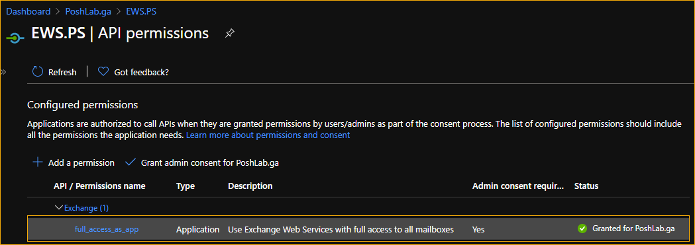

# EWS.PS
PowerShell function using EWS (OAuth2) to perform these operations against Exchange Online Mailboxes.

## Functions

- [`Get-EwsFolder`](docs/Get-EwsFolder.md)
  * List ALL folders from a mailbox
  * Search a folder from mailbox by folder display name (eg. `Inbox`, `Drafts`)
  * Get a folder from mailbox by folder ID (eg. `AQMkADRmZTI3MW..`)
- [`Move-EwsItem`](docs/Move-EwsItem.md)
  * Move all mailbox items from one folder to another
  * Move mailbox items between dates from one folder to another

> *Note: These functions use OAuth token to authenticate with Exchange Online. Basic authentication using username and password is not supported*

## Requirements

- A registered Azure AD app
  * **API Name:** *Exchange*
  * **API Permission Type:** *Application*
  * **API Permission Name:** *full_access_as_app*

       A registered Azure AD App with full_access_as_app API permisson

- Windows PowerShell 5.1
- [Exchange Web Services Managed API 2.2](https://www.microsoft.com/en-us/download/details.aspx?id=42951)
- [MSAL.PS](https://www.powershellgallery.com/packages/MSAL.PS) Module must be installed on your computer. This will be used to get the access token from Office 365 using the `Get-MsalToken` cmdlet.

### Usage Examples

- [Access Token Requirement](/docs/Get-EwsFolder.MD/#access-token-requirement)
- [Example 1: List All Folders In A Mailbox](#example-1--list-all-folders-in-a-mailbox)
- [Example 2: Find A Folder Using Folder Name](#example-2--find-a-folder-using-folder-name)
- [Example 3: Find A Folder Using Folder ID](#example-3--find-a-folder-using-folder-id)