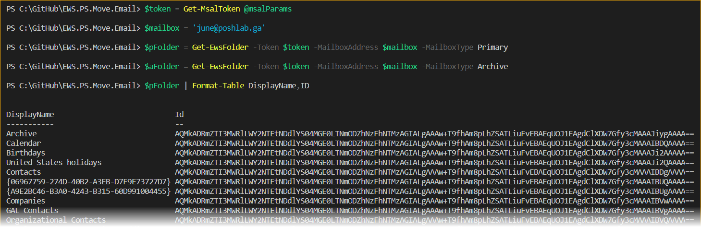
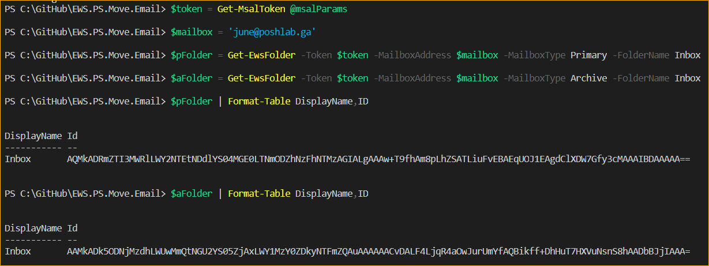
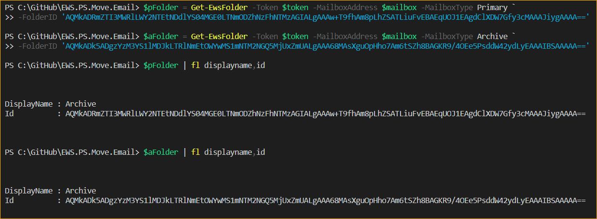

# Get-EwsFolder

This function uses EWS calls to do the following:
- List ALL folders from a mailbox
- Search a folder from mailbox by folder display name (eg. `Inbox`, `Drafts`)
- Get a folder from mailbox by folder ID (eg. `AQMkADRmZTI3MW..`)

> Note: This function uses OAuth token to authenticate with Exchange Online. Basic authentication using username and password.

## Requirements

- A registered Azure AD app
   - **API Name:** *Exchange*
   - **API Permission Type:** *Application*
   - **API Permission Name:** *full_access_as_app*

      <br><font size="1">A registered Azure AD App with full_access_as_app API permisson</font>

- Windows PowerShell 5.1
- [Exchange Web Services Managed API 2.2](https://www.microsoft.com/en-us/download/details.aspx?id=42951)
- [MSAL.PS](https://www.powershellgallery.com/packages/MSAL.PS) Module must be installed on your computer. This will be used to get the access token from Office 365 using the `Get-MsalToken` cmdlet.

## Parameter Sets

```PowerShell
# List All Folders In A Mailbox
Get-EwsFolder -Token <AuthenticationResult> -MailboxAddress <string> -MailboxType <string> [<CommonParameters>]
```

```PowerShell
# Find A Folder Using Folder Name
Get-EwsFolder -Token <AuthenticationResult> -MailboxAddress <string> -MailboxType <string> -FolderID <string> [<CommonParameters>]
```

```PowerShell
# Find A Folder Using Folder ID
Get-EwsFolder -Token <AuthenticationResult> -MailboxAddress <string> -MailboxType <string> -FolderName <string> [<CommonParameters>]
```

## Usage Examples

### Example 1: List All Folders In A Mailbox

```PowerShell
# Get MSAL Token using CLIENT ID,  CLIENT SECRET, and TENANT ID
$msalParams = @{
    ClientId = 'CLIENT ID'
    ClientSecret = (ConvertTo-SecureString 'CLIENT SECRET' -AsPlainText -Force)
    TenantId = 'TENANT ID'
    Scopes   = "https://outlook.office.com/.default"
}
$token = Get-MsalToken @msalParams

# Mailbox SMTP Address of the user to impersonate
$mailbox = 'june@poshlab.ga'

# Get all mailbox folders from the user's primary mailbox
$pFolder = Get-EwsFolder -Token $token -MailboxAddress $mailbox -MailboxType Primary

# Get all mailbox folders from the user's archive mailbox
$aFolder = Get-EwsFolder -Token $token -MailboxAddress $mailbox -MailboxType Archive
```

<br><font size="1">List All Folders In A Mailbox</font>

### Example 2: Find A Folder Using Folder Name

```PowerShell
# Get MSAL Token using CLIENT ID,  CLIENT SECRET, and TENANT ID
$msalParams = @{
    ClientId = 'CLIENT ID'
    ClientSecret = (ConvertTo-SecureString 'CLIENT SECRET' -AsPlainText -Force)
    TenantId = 'TENANT ID'
    Scopes   = "https://outlook.office.com/.default"
}
$token = Get-MsalToken @msalParams

# Mailbox SMTP Address of the user to impersonate
$mailbox = 'june@poshlab.ga'

# Search for the folder with name 'Inbox' in the user's Primary Mailbox
$pFolder = Get-EwsFolder -Token $token -MailboxAddress $mailbox -MailboxType Primary -FolderName Inbox

# Search for the folder with name 'Inbox' in the user's Archive Mailbox
$aFolder = Get-EwsFolder -Token $token -MailboxAddress $mailbox -MailboxType Archive -FolderName Inbox
```

<br><font size="1">Find A Folder Using Folder Name</font>

### Example 3: Find A Folder Using Folder ID

```PowerShell
# Get MSAL Token using CLIENT ID,  CLIENT SECRET, and TENANT ID
$msalParams = @{
    ClientId = 'CLIENT ID'
    ClientSecret = (ConvertTo-SecureString 'CLIENT SECRET' -AsPlainText -Force)
    TenantId = 'TENANT ID'
    Scopes   = "https://outlook.office.com/.default"
}
$token = Get-MsalToken @msalParams

# Mailbox SMTP Address of the user to impersonate
$mailbox = 'june@poshlab.ga'

# Search for the folder ID in the user's Primary Mailbox
$pFolder = Get-EwsFolder -Token $token -MailboxAddress $mailbox -MailboxType Primary `
-FolderID 'AQMkADRmZTI3MWRlLWY2NTEtNDdlYS04MGE0LTNmODZhNzFhNTMzAGIALgAAAw+T9fhAm8pLhZSATLiuFvEBAEqUOJ1EAgdClXDW7Gfy3cMAAAJiygAAAA=='

# Search for the folder ID in the user's Archive Mailbox
$aFolder = Get-EwsFolder -Token $token -MailboxAddress $mailbox -MailboxType Archive `
-FolderID 'AQMkADk5ADgzYzM3YS1lMDJkLTRlNmEtOWYwMS1mNTM2NGQ5MjUxZmUALgAAA68MAsXguOpHho7Am6tSZh8BAGKR9/4OEe5PsddW42ydLyEAAAIBSAAAAA=='
```

<br><font size="1">Find A Folder Using Folder ID</font>